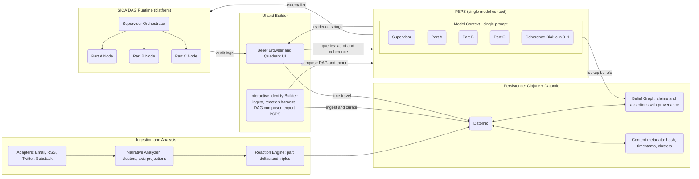
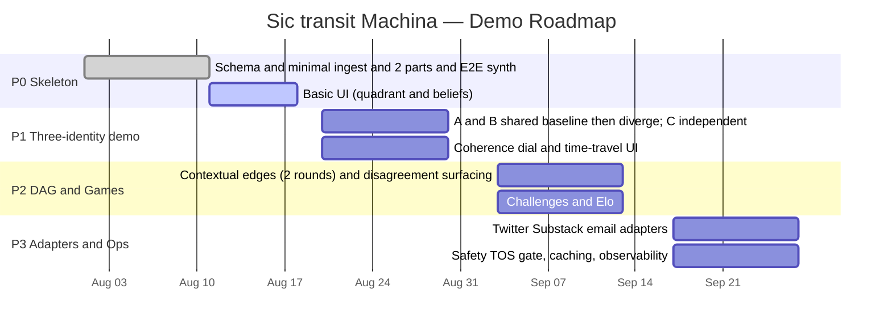
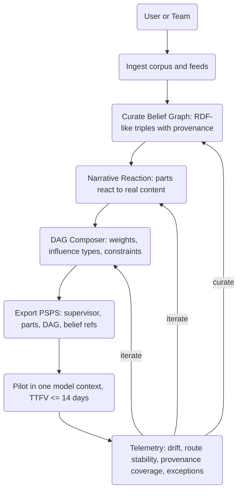
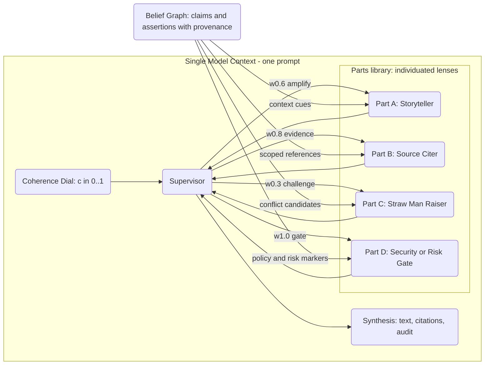
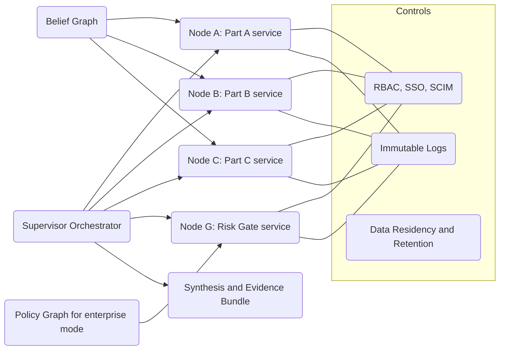

# Sic Transit Machina
Synthetic Identity Composite Agents DAG
Synthetic Identity Composite Language
Prompt-Simulated Part System
Plural Identity Engine

> *Deterministic perspective from a media diet, not external “truth.”*  
> *Contradictions are a feature. Style emerges. Identity is a graph of parts.*

Sic transit Machina implements **synthetic identities** as ensembles of **individuated parts** (IFS‑inspired metaphor, software‑implemented) that react to content streams, accumulate a **Belief Graph** (RDF‑like assertions with provenance), and speak through a **Supervisor** that routes across a **weighted DAG** of parts. Parts sit in a **two‑axis, four‑quadrant** value space; each reaction updates orientation. Identities subscribe to content (email/RSS/Twitter/Substack adapters), and their “personality” is the deterministic result of **diet + rules**. A **coherence dial** controls how much contradiction to *surface* per output (we never delete contradictions).

We support two usage modes with the same engine:
- **Belief Mode** (research/media/creative): outputs may surface contradictions with lineage.  
- **Policy Mode** (enterprise/compliance): outputs constrained to a signed **Policy Graph** (policy‑of‑record), while contradictions remain visible in storage/QA.

> **Design stance:**
> - Narrative bias is the **product**, not a bug. We optimize **perspective fidelity** and **internal cohesion**, not outside fact‑checking.
> - **Contradictions stay.** We don’t minimize them; we *index* them. A coherence dial only controls how much contradiction to surface per output.
> - **Style is emergent.** No hand‑coded style priors; it arises from content and choices.
> - **Interest is dynamic.** No static outlet weights; each part scores interest per item at ingestion.
> - **Clojure first** (Clojure, Datomic, ClojureScript). Datomic gives us immutable facts + time‑travel.

---

## Quick links

- [`architecture.md`](architecture.md): deep dive into data model, algorithms, graph routing, ingestion, storage, and ops.
- **Demo goal**: three identities (A, B, C). A and B share a small baseline feed then **diverge**; C is **independent**. All retain contradictions. A UI knob changes *coherence* to tighten/loosen how much contradiction appears in a given answer.

---

## Repository Layout

```
/src
  id/schema.clj        ; Datomic schema tx
  id/ingest.clj        ; adapters (email/RSS) -> normalized content
  id/narrative.clj     ; narrative clustering -> axis deltas
  id/react.clj         ; per-part reaction -> deltas + triples
  id/graph.clj         ; dynamic DAG construction and routing
  id/supervisor.clj    ; orchestration and synthesis prompts
  id/recall.clj        ; aligned/discordant belief retrieval
  id/game.clj          ; challenges, pairwise ranking, Elo
  id/ui/               ; CLJS UI (quadrants, belief browser)
/resources
  schema.edn           ; Datomic attrs
  prompts/             ; supervisor and part prompt templates
  seeds/               ; demo content feeds (A/B shared+diverge, C separate)
/docs
  README.md
  architecture.md
```

## Premise & Theory (short)

- **Parts** are archetypal lenses (“Storyteller”, “Source‑Citer”, “Straw‑Man‑Raiser”, “Security”, etc.) instantiated as **individuated parts** with their own memory, value orientation (2D), and interest function.
- **Reactions** to content produce:
  - a **values vector** (axis deltas in the part’s 2D),
  - **belief assertions** (RDF‑ish triples) with provenance,
  - **references**, some followed recursively by an **interest function** (with an *external exploration rate*).
- **Identity** = set of parts + a **supervisor** that routes messages along a **DAG** and synthesizes output. The supervisor honors a **coherence threshold** (how much contradiction to surface).
- **Truth model**: internal coherence + lineage only. No outside arbiter.

---


## System Overview



## Getting Started (dev)

1. **Prereqs**: Clojure CLI, Datomic (Cloud or On‑Prem), Node/Yarn for CLJS UI.  
2. **Run Datomic** and set `DATOMIC_URI` in `.env`.  
3. **Load schema and seeds**:
   ```bash
   clj -X:id.schema/load
   clj -X:id.ingest/seed
   ```
4. **Start backend**:
   ```bash
   clj -M:run
   ```
5. **Start UI**:
   ```bash
   clj -M:shadow watch app
   ```
6. Open http://localhost:8080

> **Agent note**: read `architecture.md` → use `id/schema.clj` to infer entity keys; batch transactions per content item; do not upsert raw article bodies into Datomic (store in object storage, keep hash + metadata only).

---

## Roadmap

> - P0 — Skeleton: schema, minimal ingestion, two parts, single identity, end‑to‑end reaction → synthesis.
> - P1 — Three‑identity demo: A/B shared+diverge feeds, C independent; recursion depth 1; coherence dial; quadrant/time‑travel UI.
> - P2 — DAG & games: contextual edges, 2 deliberation rounds max, pairwise ranking, Elo.
> - P3 — Adapters: Twitter/Substack/email at scale; safety/TOS gate; caching; ops hardening.




---

## Demo

- Three identities (A, B, C)
  - **A & B** ingest a shared 30‑item baseline, then each diverges (different source adapters).
  - **C** ingests a separate stream.
  - All feeds include **paired contradictions**.
- UI:
  - per‑part **quadrant map** over time,
  - **belief browser** (aligned vs discordant assertions with provenance),
  - **coherence** dial (0.2 → embrace contradiction, 0.8 → tighten),
  - **time travel** selector (Datomic `as-of`).
- Game:
  - writing/joke challenges with pairwise ranking → Elo per identity.

---

## Wedge: Interactive Identity Builder (IIB)

**We do not ship prompts; we ship the machine that manufactures them.** The **Builder** constructs a **Composite Identity** (Supervisor + Parts + **weighted DAG**) and exports a **PSPS** artifact: a single‑prompt composite deployable in one model context.



---

### PSPS (Prompt‑Simulated Composite)



---

## Platform Vision: SICA DAG Runtime

Externalize the simulated composite into a runtime with **hard permissions**, **audit logs**, and **vendor/model agnosticism**.



---

## Design Inspirations (appendix)

We borrow language from modular cognitive theories (e.g., IFS as a legible **metaphor** for “parts”), classic AI orchestration (blackboard, behavior trees/HTNs), and modern workflow DAGs. In practice, our composites are **deterministic software artifacts**: a supervisor‑routed, weighted DAG with belief‑bounded knowledge and auditable outputs.

---

## License

Copyright © 2025 Penny & Damed Inc. **All rights reserved.**
