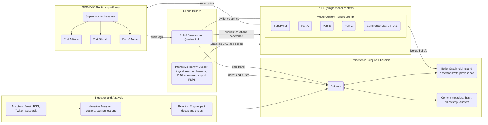
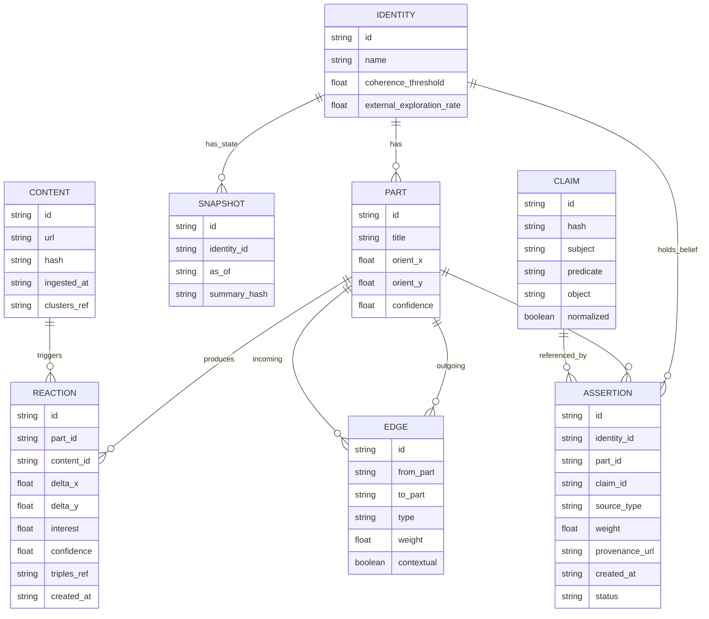
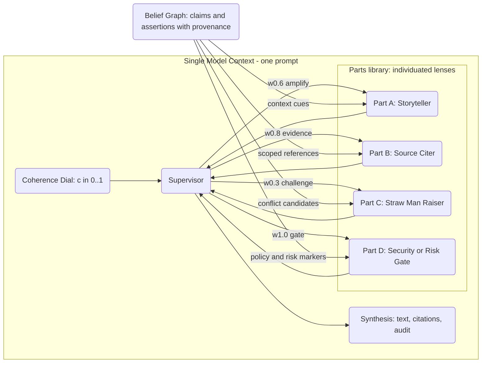
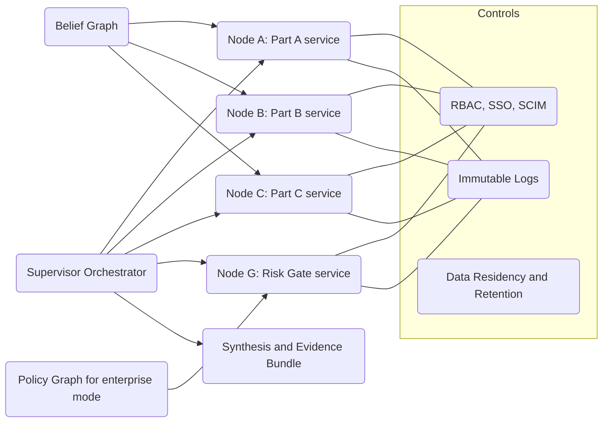
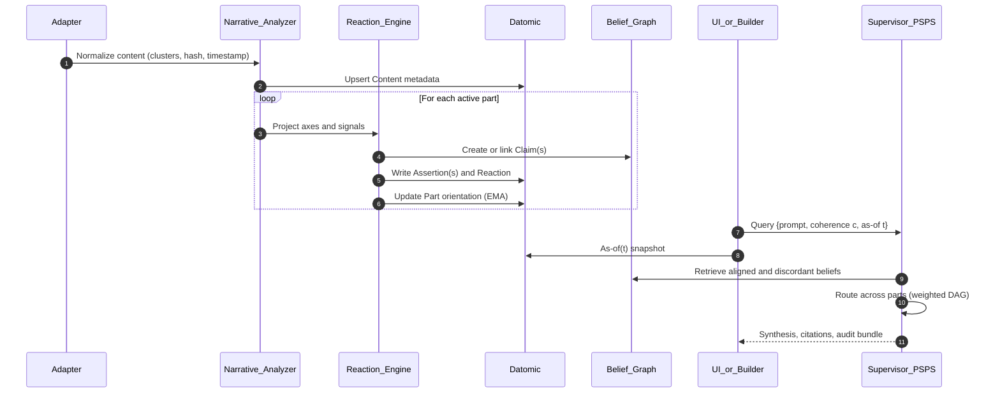

# Architecture (first principles + contracts)

This document is **human‑ and agent‑facing**. It states the premises first, then the minimum formalism an AI agent needs to implement, test, and extend the system safely.

---

## 0) First principles (privileging Scarlet’s statements)

1. **Bias is the product.** We produce **deterministic perspective** from a **media diet**. Optimize **perspective fidelity** and **cohesion** within the identity’s own corpus; do not chase an external “truth.”
2. **Contradictions are a feature.** We **retain** incompatible beliefs. A **coherence threshold** only controls *how much* contradiction to surface **per output**; it does not delete or minimize contradictions.
3. **Style is emergent.** No hand‑coded style priors. Voice emerges from content and synthesis choices.
4. **Dynamic interest.** No static outlet weights. Each **part** computes **interest** per item (alignment, novelty, recency, exploration).
5. **Clojure + Datomic**. Time‑travel, immutability, Datalog recursion suit this domain. Datoms are cheap enough for our demo and early growth (watch write throughput and index growth).

---

## 1) System overview

### Components
- **Ingestion adapters**: email/RSS/Twitter/Substack → normalized `Content`.
- **Narrative analyzer**: maps content to **narrative clusters** and **axis projections** (per part).
- **Reaction engine**: for each active **part**, compute axis deltas, extract **belief triples** with provenance, score `interest`, optionally recurse on references.
- **Graph router**: builds a **contextual DAG** among active parts; 0–2 rounds of message passing with typed influences.
- **Supervisor**: orchestrates routing and **synthesizes** the final answer with a **coherence** dial.
- **Persistence (Datomic)**: immutable entities for `Identity`, `Part`, `Content`, `Reaction`, `Claim`, `Assertion`, `Edge`, `Snapshot`.
- **UI (CLJS)**: quadrant maps over time, belief browser, time‑travel, coherence dial.
- **Game loop**: challenges, pairwise ranking, Elo.

ASCII sketch:

Adapters -> Narrative Analyzer -> Reaction Engine -> [Datomic]
|                 ^
v                 |
Graph Router ––> Supervisor
|                 |
v                 |
Synthesis –––––> UI



---

## 2) Data model (abstract → Datomic)

> **Key idea**: Deduplicate **claims** across identities; store **assertions** (beliefs) per identity/part with stance, weight, and provenance. This keeps contradictions and controls growth.

### Entities (conceptual)
- **Axis**: `{id, neg-label, pos-label}`
- **Part**: `{id, title, axis-a, axis-b, orient: [x y], confidence}`
- **Identity**: `{id, name, parts[], coherence-threshold, external-exploration-rate}`
- **Content**: `{id, url|hash, ingested-at, narrative-clusters[]}`
- **Reaction**: `{id, part, content, delta:[dx dy], interest, confidence, triples[], created-at}`
- **Claim**: `{id, hash, subject, predicate, object, normalized?}`
- **Assertion**: `{id, identity, part, claim, status: :current|:superseded|:archived, weight, source, created-at}`
- **Edge**: `{id, from-part, to-part, type, weight, contextual?}`
- **Snapshot**: `{id, identity, as-of, summary-hash}`

### Datomic attributes (selected)
- `:part/orientation` may be stored as tuple `:db.type/tuple` `[double double]` **or** as `:part/orient-x` & `:part/orient-y`.
- Mark **derived/high‑churn** fields `:db/noHistory true` (e.g., rolling novelty, embeddings).
- Index only lookup keys (`:claim/hash`, small enums). Keep raw bodies outside Datomic; store a hash + pointer.

See `resources/schema.edn` for full attribute list.



**Notes**  
- Store raw content in object storage; keep `hash`, `url`, `ingested_at`, and cluster metadata in Datomic.  
- Mark high‑churn derived fields with `:db/noHistory true`.
- Index lookup keys (`:claim/hash`) and small enums.

---

## 3) PSPS internals (single‑prompt composite)



**Contracts**  
- **Supervisor**: routes across parts per weighted DAG; honors coherence level.  
- **Parts**: deterministic style, 2‑axis orientation, scoped interest function, belief extraction.  
- **Evidence strings**: record route taken, beliefs cited, dissent surfaced.

---

## 4) SICA DAG runtime (externalized nodes)



**Enterprise Mode**  
- Outputs constrained to **Policy Graph** only; **Belief Graph** remains available for QA/analytics.  
- Add SSO/SCIM, RBAC, immutable logs, exportable evidence, residency controls.

---

## 5) Algorithms (minimal contracts)

### 5.1 Interest (dynamic, per part)
Inputs: `part.orientation`, `axis delta projection` from narrative analyzer, `novelty(part, content)`, `recency(content)`, `external-exploration-rate`.
Output: `interest ∈ [0,1]`.

```
interest = 0.55*dot(v_hat, Delta_hat) + 0.25*novelty + 0.15*recency + 0.05*epsilon
activate if interest >= tau (default tau=0.25)
```

```mermaid
flowchart TD
  O(Part orientation v_hat)
  DP(Delta projection Delta_hat)
  NOV(Novelty)
  REC(Recency)
  EPS(Epsilon explore)
  CALC(interest = 0.55*dot(v_hat,Delta_hat) + 0.25*nov + 0.15*rec + 0.05*epsilon)
  THR{interest >= tau?}
  ACT(Activate reaction)
  SKIP(Skip this part)

  O --> CALC
  DP --> CALC
  NOV --> CALC
  REC --> CALC
  EPS --> CALC
  CALC --> THR
  THR -->|yes| ACT
  THR -->|no| SKIP
```

### 5.2 Reaction
- Compute `delta:[dx, dy]` (aggregate per content’s clusters).
- Extract **triples** *(subject, predicate, object)* and provenance *(source URL, timestamp, cluster)*.
- Create or link to **Claim** by stable `hash(subject|predicate|object)`.
- Create **Assertion** for this identity/part; set `status :current`, `weight = confidence × interest`.

### 5.3 Orientation update (contradiction‑friendly)
EMA with small `α` to keep old beliefs alive:

```
v_next = normalize((1 - alpha)*v + alpha*Delta) ; default alpha=0.10
```
Default `α=0.10`.

### 5.4 Reference recursion
Priority queue BFS to depth D in {1,2}; enqueue by `score = b1*interest + b2*novelty + epsilon`.

Follow while within per‑content budget. `ε` comes from `external-exploration-rate` to permit misaligned sources.

### 5.5 Graph routing (contextual DAG)
- Build **edges** between active parts with types `:amplify | :challenge | :reframe | :request-evidence`.
- Edge weights proportional to source part’s `interest`. Topologically sort by layers or impose max **2 rounds** to avoid loops.

### 5.6 Synthesis (coherence dial)
- Gather aligned & discordant assertions relevant to the prompt.
- **Coherence threshold** `c∈[0,1]` controls mix:
  - include `⌈(1-c) * k⌉` discordant clusters alongside aligned ones.
- Objective: maximize perspective fidelity + internal cohesion + task fitness; **do not** delete contradictions in storage—only choose how much to *surface*.

```mermaid
flowchart LR
  INQ(Prompt)
  C(Coherence c in 0..1)
  SEL(Select aligned beliefs: top-k)
  DISC(Select discordant beliefs: ceil((1-c)*k))
  SYN(Compose supervised synthesis)
  OUT(Answer with citations and dissent notes)

  INQ --> C
  C --> SEL
  C --> DISC
  SEL --> SYN
  DISC --> SYN
  SYN --> OUT
```

---

## 6) Sequence: ingestion to synthesis (with time travel)



---

## 4) Interaction paradigms

1. **Subscribe & evolve**  
   Identities ingest streams; parts react; orientations drift; assertions accrue; contradictions persist.
2. **Converse**  
   Ask the identity a question *as of* a timestamp; supervisor selects parts, pulls aligned + discordant beliefs (weighted by `coherence-threshold`), generates an answer + provenance.
3. **Time travel**  
   Use Datomic `as-of` to load historical state and answer from that identity phase.
4. **Games**  
   Run challenges (writing/jokes/debates). Rank via pairwise voting; update **Elo** per identity and per part. Coherence dial becomes a creative control.

---

## 5) Technology choices

- **Language**: Clojure (backend/orchestration), ClojureScript (UI).
- **Storage**: Datomic (Cloud or On‑Prem). Immutable facts, time‑travel, Datalog recursion.  
  - **Ops notes**: single transaction stream (batch writes), monitor index build, use `:db/noHistory` on high‑churn fields, store raw content in object storage.
- **Graph utils**: Loom (graph algorithms) or pure Datalog rules for neighborhoods.
- **Embedding/Clustering (optional)**: any JVM‑friendly lib; persisted vectors go in object storage with keys in Datomic.

---

## 6) Project phases & deliverables

### Phase 0 — Skeleton (1–2 parts, 1 identity)
- Schema tx; minimal narrative analyzer (rule‑based).
- Reaction → assertions; orientation EMA.
- Supervisor (single pass); basic UI with quadrant + belief list.

### Phase 1 — Three‑identity demo
- Identities **A & B** share a 30‑item baseline, then diverge; **C** independent.
- Recursion depth 1; coherence dial.
- Time‑travel UI; provenance viewer.

### Phase 2 — Contextual DAG + games
- Edge types & 2 rounds max; disagreement surfacing.
- Challenges + pairwise voting UI; Elo updates.

### Phase 3 — Adapters & ops
- Email/Twitter/Substack adapters with backoff + de‑duplication.
- Safety/TOS gate before publishing; caching; observability.

---

## 7) API surfaces (for agents and services)

### 7.1 Ingestion (idempotent EDN shape)

```edn
{:op :ingest/content
 :content/id #uuid "...",
 :content/url "https://…",
 :content/hash "sha256:…",
 :content/ingested-at #inst "2025-08-17T12:34:56.000-00:00",
 :content/narr-clusters [:entrepreneurship :preservation]}
```

### 7.2 Reaction

```edn
{:op :react
 :identity/id #uuid "...",
 :part/id #uuid "...",
 :content/id #uuid "...",
 :reaction
 {:delta [0.18 -0.05]
  :interest 0.62
  :confidence 0.70
  :triples [{:s ":zoning_reform" :p ":improves" :o ":small_business_growth"
             :source "https://…" :cluster :entrepreneurship}]}}
```

### 7.3 Synthesis

```edn
{:op :synthesize
 :identity/id #uuid "…"
 :as-of #inst "2025-08-16T00:00:00.000-00:00"
 :coherence 0.35
 :prompt "Write 150 words on zoning reform and small business."
 :output {:text "...", :citations [{:claim/hash "…" :source "…"}]}}
```

---

## 8) Query patterns (Datalog)

Aligned and discordant objects for a (s,p) per part:

```clojure
(d/q '[:find ?s ?p (distinct ?o) ?part
       :in $ ?part
       :where
       [?a :assertion/part ?part]
       [?a :assertion/claim ?c]
       [?c :claim/subject ?s]
       [?c :claim/predicate ?p]
       [?c :claim/object ?o]]
     db part-id)
```

Time‑travel:

```clojure
(let [db' (d/as-of db #inst "2025-08-01T00:00:00.000-00:00")]
  (d/q '[:find ...] db' ...))
```

---

## 9) Concerns and mitigations

- **Write throughput** (single transaction stream): batch per content item; queue; keep tx sizes moderate.  
- **Index/storage growth**: deduplicate **Claims**; `:db/noHistory` on churn; avoid indexing large text.  
- **Epistemic closure**: allow epsilon‑explore; visualize provenance and diet boundaries.  
- **Safety/TOS**: pre‑publish gate (defamation, direct harm, platform rules).  
- **Part proliferation**: require persistent cluster mismatch to spawn; prune dormant parts.  
- **Identity drift attacks**: log diet changes; cap daily orientation shift; require owner approval to exceed.

---

## 10) Testing and evaluation

- **Perspective fidelity**: cosine similarity between output’s implied axis vector and identity/part orientations.  
- **Cohesion**: fraction of claims in output that exist as current assertions with sufficient weight.  
- **Contradiction surfacing**: count discordant clusters vs expected at coherence `c`.  
- **Engagement/game**: Elo changes, human votes, style diversity metrics.  
- **Regression**: replay ingestion; assert deterministic state under same seeds and timestamps.

---

## 11) Open questions

- Dynamic vs static DAG topology beyond two rounds.  
- Multi‑modal ingestion (audio/video) normalization into clusters.  
- Partitioning across multiple Datomic DBs for very high write rates.  
- How to snapshot “style” observationally without hard‑coding a prior.

---


## 12) Minimal prompts (scaffolds)

Supervisor (coherence‑aware)
```
You are the supervisor for identity {IDENTITY_NAME}.
Goal: maximize perspective fidelity and internal cohesion for THIS identity.
Do NOT resolve contradictions globally. Surface aligned beliefs first, then include {K} discordant strands.

Inputs:
- coherence: {c in [0,1]}
- time context: {as-of timestamp}
- selected parts: [{part-title, orientation [x,y], aligned claims[], discordant claims[]}]

Output (JSON):
- per-part contributions with citations (from our assertions)
- final synthesis text (<=N words), “Yes—and / On the other hand” structure scaled by c
- audit: which claims used, weights, dissent notes
```

Part reaction
```
You are the {PART_TITLE} part.
React to content clusters {…}.
Produce:
- axis delta [dx, dy] in your two-axis space
- belief triples with provenance (subject, predicate, object)
- interest score in [0,1] (alignment, novelty, recency, ε-explore)
Do not delete previous beliefs. You may add contradictory ones.
```

---

## 13) Demo plan (A/B shared+diverge, C independent)
- Seed 30 items common to A + B, then feed A with streams {A1, A2}, B with {B1, B2}, C with {C*}. Insert paired contradictory articles in all.
- Show:
- Part quadrant trajectories (A vs B diverge; C distinct).
- Belief browser for hot claims with multiple objects (contradictions visible).
- Same prompt at c=0.3 vs c=0.8 to reveal “personality tightening.”
- Head‑to‑head challenge; votes → Elo updates.

---

## 14) Implementation tips (for agents)
- Transact one content item per identity as a single transaction (content meta + reactions + assertions + orientation updates).
- Always upsert Claim by :claim/hash; never duplicate.
- Store raw bodies in object storage; Datomic holds hashes/links.
- Keep recursion depth small; log which misaligned references were accepted due to ε‑explore.
- Use as-of consistently in queries when answering at a historical point.# Architecture (first principles and contracts)

